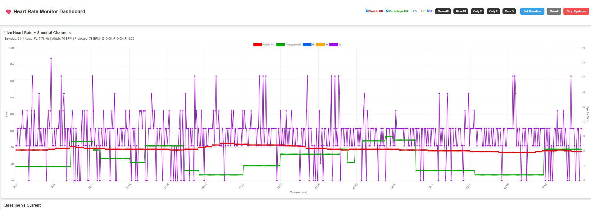
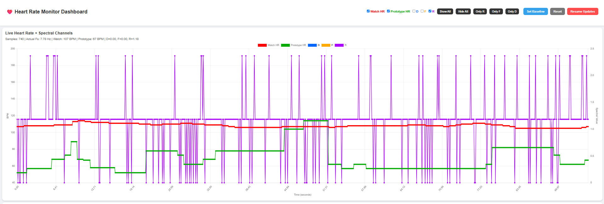
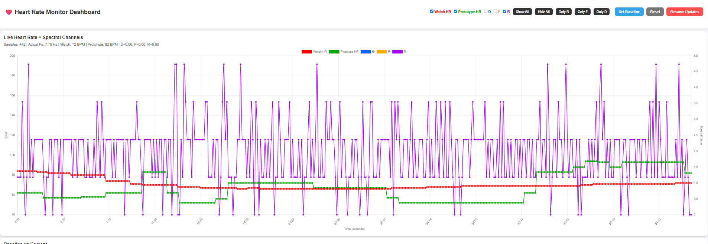

# BLE Heart Rate Logger & Multi-Spectral Heart Rate Validation Platform

A Python-based Bluetooth Low Energy (BLE) data collection and validation framework used for investigating heart-rate estimation from a custom spectrometer-based wearable prototype.

The system collects heart-rate measurements from a Garmin smartwatch (ground truth) while simultaneously receiving optical measurements from a custom ESP32 + AS7265x spectrometer platform. The collected data is used to evaluate whether heart-rate information can be extracted from spectral signals using signal-processing techniques such as FFT analysis.

---

# Project Context

This project forms part of an MSc research investigation into wearable optical sensing using multi-wavelength spectroscopy.

## Research Goal

Traditional wearable devices typically use one or two optical wavelengths (usually green LEDs around 525 nm) for photoplethysmography (PPG).

The objective of this project is to investigate whether a multi-spectral sensor can provide usable heart-rate information across a broader wavelength range.

Research questions include:

* Which wavelengths contain the strongest pulse information?
* Can heart rate be estimated from spectral measurements alone?
* Which spectral channels provide the best signal quality?
* How does a low-cost spectrometer compare against a commercial smartwatch?
* Can multi-channel fusion improve estimation accuracy?

---

# Hardware Platform

## Ground Truth Device

* Smart watch with BLE heartrate 
* BLE Heart Rate Service
* Wrist-based optical heart-rate monitor
* Used as reference / ground truth

## Prototype Device

ESP32-WROOM-32E

AS7265x Spectral Sensor

Features:

* 18 calibrated spectral channels
* Wavelength range: 410 nm – 940 nm
* White, IR and UV illumination
* BLE communication
* Real-time streaming

---

# System Architecture

```text
Garmin Watch (BLE HR)
        │
        ▼
 heart_rate_logger.py
        │
        ▼
 Ground Truth HR
        │
        ├──────────────┐
        │              │
        ▼              ▼
Validation      Real-time Dashboard

ESP32 + AS7265x
        │
        ▼
Spectral Measurements
        │
        ▼
FFT-based HR Estimation
        │
        ▼
Prototype HR
```

---

# Heart Rate Estimation Method

Current prototype heart-rate estimation uses frequency-domain analysis.

Pipeline:

1. Receive spectral samples from ESP32
2. Estimate sampling rate from timestamps
3. Remove DC component
4. Apply band-pass filtering
5. Perform FFT
6. Search for dominant frequency in physiological HR range
7. Convert dominant frequency to BPM

Mathematically:

```text
Heart Rate (BPM) = Dominant Frequency (Hz) × 60
```

Search range:

```text
0.7 Hz – 2.0 Hz
≈ 42 BPM – 120 BPM
```

---

# Current Prototype Configuration

Final checkpoint configuration:

Sensor:

* AS7265x

Channels evaluated:

* Multiple channels investigated
* Best results observed from channel R

Sampling rate:

* Approximately 7–8 Hz

Integration cycles:

* 2

Gain:

* 64×

Illumination:

* White LED

---

# Experimental Results

Three heart-rate ranges were evaluated.

## Resting Heart Rate (70–80 BPM)

Prototype demonstrated the best performance in this range.

Observed behaviour:

* Prototype generally followed HR trend
* Estimates remained relatively stable
* Typical error within approximately ±10 BPM

Image:



---

## Elevated Heart Rate (>100 BPM)

Observed behaviour:

* Prototype frequently underestimated HR
* FFT peak became less reliable
* Limited sampling rate reduced frequency resolution

Image:



---

## Lower Heart Rate (<70 BPM)

Observed behaviour:

* Partial tracking achieved
* Increased instability
* Larger estimation fluctuations

Image:



---

# Discussion

Results indicate that physiological pulse information is present within the measured spectral signal.

The prototype successfully demonstrates:

* Detection of periodic biological signals
* Extraction of pulse-related frequency components
* Approximate heart-rate estimation at resting HR levels

However, several limitations were observed.

## Limitation 1: Sampling Rate

Current sampling rate:

```text
≈ 7.7 Hz
```

This significantly limits:

* FFT frequency resolution
* Detection of rapid HR changes
* High-HR accuracy

Higher sampling rates (>25–50 Hz) are expected to improve performance substantially.

## Limitation 2: Motion Sensitivity

The sensor is highly sensitive to:

* Wrist movement
* Sensor pressure
* Ambient light leakage

These effects introduce noise and produce unstable FFT peaks.

## Limitation 3: Channel Selection

Not all spectral channels contain useful pulse information.

Experiments suggest that some channels consistently outperform others, indicating that wavelength selection is an important factor in wearable optical sensing.

---

# Conclusion

This work demonstrates that heart-rate information can be extracted from a low-cost multi-spectral sensing platform.

Key findings:

* Pulse-related information is present in spectral measurements.
* Resting heart rates (70–80 BPM) produced the most reliable estimates.
* Accuracy deteriorated at low and high heart-rate ranges.
* Sampling rate appears to be the primary technical limitation of the current prototype.

While the prototype is not yet suitable for reliable heart-rate monitoring, the results validate the feasibility of using multi-spectral optical sensing as a foundation for future wearable heart-rate estimation systems.

---

# Future Work

Planned improvements:

* Increase sampling rate
* Evaluate all 18 channels systematically
* Compare SNR across wavelengths
* Investigate channel fusion methods
* Collect larger datasets
* Perform MAE and RMSE evaluation
* Explore machine-learning-based HR estimation
* Investigate adaptive filtering techniques
* Design improved wearable enclosure

---

# Author

**Muhammad Haris Irfan**

MSc Computer Science
University of Tartu

Research Areas:

* Embedded Systems
* Wearable Sensing
* Optical Signal Processing
* Biomedical Signal Analysis
* Machine Learning for Sensor Systems
